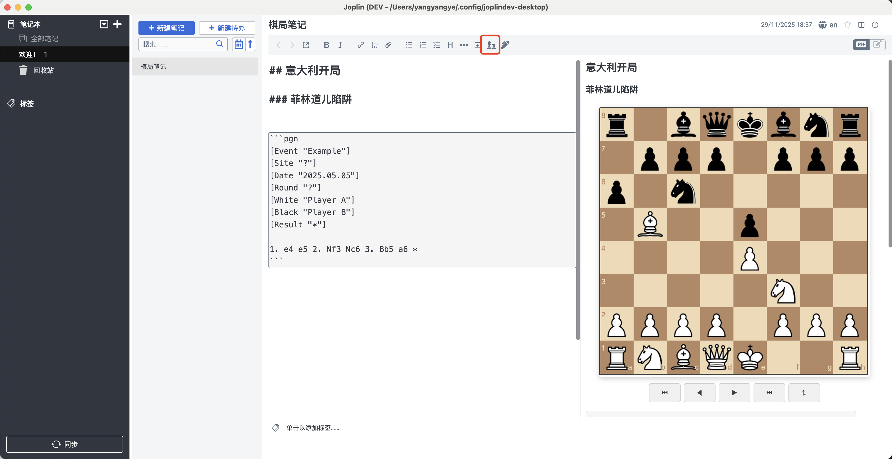

# Chess Viewer

This plugin for viewing and replaying chess games in Joplin Notes. Supports PGN format.


## Usage

In markdown editor, clicking the "Insert PGN" button on the toolbar will automatically insert a PGN code block template:

```pgn
[Event "Example"]
[Site "?"]
[Date "2025.05.05"]
[Round "?"]
[White "Player A"]
[Black Player B"]
[Result "*"]

1. e4 e5 2. Nf3 Nc6 3. Bb5 a6
```



## License

MIT

## Donation


Your support is my motivation to move forward.

